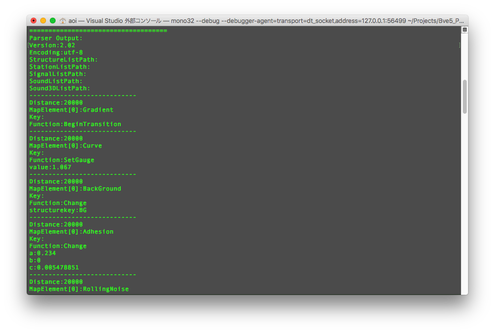

[](https://travis-ci.org/aoisupersix/Bve5_Parsing)
[](#contributors)
[](https://badge.fury.io/nu/Bve5_Parsing)
[](/License.md)

Bve5_Parsing
===



BveTrainSim5構文の.NETパーサライブラリです。
入力された文字列やファイルを解析し、プログラム上で利用しやすい形式に変換します。
現在マップファイルとシナリオファイル構文に対応しています。

## Supported Syntaxes
- #### Scenario File
    - Bve5の全構文に対応
- #### Map File
    - マップファイルのバージョン1.00から2.02に対応。
    - 数式や変数、Includeディレクティブにも対応しています。

その他は今後作っていきます👍

## Requirements
* .Net Standard 2.0 or .Net framework 4.5

## Installation
Nugetで[Bve5_Parsing](https://www.nuget.org/packages/Bve5_Parsing/)としてパッケージを公開しています。

- コマンドラインからインストールする場合
  ```
  nuget install Bve5_Parsing
  ```

- VisualStudioからインストールする場合
  1. ツール > Nugetパッケージマネージャ > ソリューションのNugetパッケージの管理をクリック
  2. 参照タブで```Bve5_Parsing```を検索
  3. インストールをクリック

## Usage for C\# ##

C#でマップファイルのパースを行う場合 

```csharp
using Bve5_Parsing.MapGrammar;
using Bve5_Parsing.MapGrammar.EvaluateData;
using System.Linq;

...
    string input; //String to be analyzed
    MapGrammarParser parser = new MapGrammarParser();

    // 文字列をマップ構文としてパースする
    MapData mapData = parser.Parse(input);
    // マップファイルへのファイルパスを指定してパースする
    MapData mapData2 = parser.ParseFromFile(@"PATH/TO/MAP/FILE");
    // Include構文の参照先を再帰的にパースする
    MapData mapDataWithInclude = parser.ParseFromFile(@"PATH/TO/MAP/FILE", MapGrammarParserOption.ParseIncludeSyntaxRecursively)
    // AST(抽象構文木)にパースする
    MapData ast = parser.ParseToAst(input, @"PATH/TO/FILE/PATH");

    // パースエラーの取得
    if (parser.ParseErrors.Any()) {
      // error handling
    }

    // 旧形式でステートメントのデータを取得する場合（通常は必要ありません）
    var syntaxData = mapData.Statements.Select(state => state.ToSyntaxData());

    mapData.Version //マップ構文のバージョン情報
    mapData.Encoding // マップ構文のエンコーディング指定
    foreach(var statement in mapData.Statements) {
      /* 各構文情報 */
      statement.Distance; //構文の距離程
      statement.FunctionName; //構文の関数名
    }
...
```

パース処理に成功した場合、結果は**MapDataクラス**で返ってきます。例えば、ファイルヘッダのバージョン情報は**MapData.Version**に格納されています。また、構文解析のエラーは**MapGrammarParser.ParserErrors**に格納されています。**MapGrammarParser.ParserErrors**ではエラーの種別(警告かエラーか)やエラーとなった構文の位置、エラーメッセージが取得出来ます。独自のエラーメッセージを実装する場合は、**MessageGenerator**を継承したカスタムクラスを実装し、**MapGrammarParserのコンストラクタ**で指定して下さい。

Bve5_Parsing.slnに含まれているParseSampleAppプロジェクトからは、コンソール上でパーサの動作を確かめることができます。Bve5_Parsingの実装例として適宜利用して下さい。

## Used Librarys
Bve5_Parsing is using the following library.

#### [ANTLR v4](http://www.antlr.org/index.html)
> The BSD License (3-clause BSD License)
>
> Copyright (c) 2012 Terence Parr and Sam Harwell

* **ライセンス全文 :** [ANTLR4ライセンス全文](/Licenses/ANTLR4.txt)

#### [ReadJEnc](https://github.com/hnx8/ReadJEnc)
> The MIT License (MIT)
>
> Copyright (c) 2017 hnx8

* **ライセンス全文 ：** [ReadJEncライセンス全文](https://github.com/hnx8/ReadJEnc/blob/master/LICENSE)

## License
The MIT License (MIT)

Copyright(c) 2017-2019 aoisupersix

**[License.md](License.md)**

## TechnicalCommentary
Bve5_Parsingの技術解説です。  
-> [TechnicalCommentary.md](TechnicalCommentary.md)

## Contributors

Thanks goes to these wonderful people ([emoji key](https://allcontributors.org/docs/en/emoji-key)):

<!-- ALL-CONTRIBUTORS-LIST:START - Do not remove or modify this section -->
<!-- prettier-ignore -->
<table><tr><td align="center"><a href="https://aoisupersix.tokyo/"><br /><sub><b>Aoi Tanaka</b></sub></a><br /><a href="https://github.com/aoisupersix/Bve5_Parsing/commits?author=aoisupersix" title="Code">💻</a></td><td align="center"><a href="https://twitter.com/S520_BVE"><br /><sub><b>s520</b></sub></a><br /><a href="https://github.com/aoisupersix/Bve5_Parsing/commits?author=s520" title="Code">💻</a></td></tr></table>

<!-- ALL-CONTRIBUTORS-LIST:END -->

This project follows the [all-contributors](https://github.com/all-contributors/all-contributors) specification. Contributions of any kind welcome!