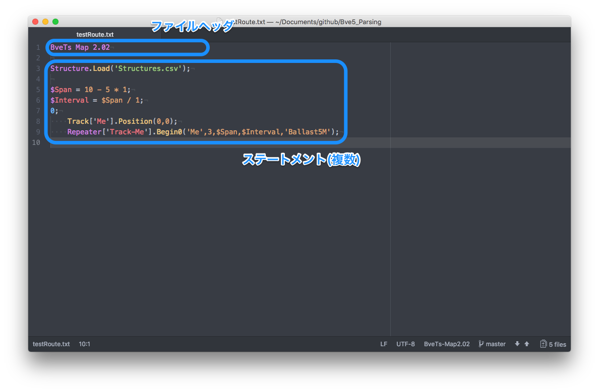

# **Bve5_Parsing 技術解説**
面接の説明用と興味のある人用のBve5_Parsing解説。

## このライブラリについて
[BveTrainsim5](http://bvets.net/)というソフトウェアのDSL(ドメイン特化言語)に対応したC#用パーサライブラリです。パースの処理にはパーサジェネレータであるANTLR4を利用。

BveTrainsim5とは、フリーの鉄道運転シミュレータで、用意された構文を用いて路線等を作成することが可能。
    →*簡単に言うと、電車でGo!みたいなもの。*

ここでは一番複雑なマップ(路線)ファイル構文のパースについて紹介します。
構文一覧 → [公式サイト](http://bvets.net/jp/edit/)

## マップファイル構文について

* 一つのファイルヘッダと0個以上のステートメントから成るファイル。
* ステートメントは、
  * 現在の距離を表す**距離程**
  * マップを操作する**基本のステートメント**
  * 変数へ値を代入する**代入文**

  に分けられる。
* 各数値や、識別子等には演算や数学関数、変数が使用可能。

## パース処理の主な流れ
パースの処理は`MapGrammarParserクラス`の`Parseメソッド`で行っています。→[ソースコードへ](/Bve5_Parsing/MapGrammar/MapGrammarParser.cs#L36-L61)  

処理の流れとしては、  
**字句解析 → 構文解析 → CST(具象構文木)の取得 → AST(抽象構文木)の作成 → ASTの評価**  
となっており、これらの内字句解析と構文解析は後述の定義よりANTLR4が行ってくれます。
## 字句と構文の定義
字句解析器と構文解析器を生成する元となる、ANTLR4の文法ファイルの定義。
#### 字句解析 [MapGrammarLexer.g4](/Bve5_Parsing/MapGrammar/ANTLR_SyntaxDefinitions/MapGrammarLexer.g4)  

#### 構文解析 [MapGrammarParser.g4](/Bve5_Parsing/MapGrammar/ANTLR_SyntaxDefinitions/MapGrammarParser.g4)  

``````
